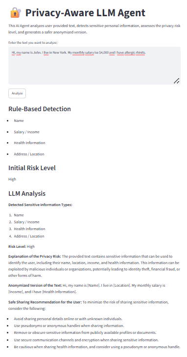

# Privacy-Aware LLM Agent

Privacy-Aware LLM Agent is a simple AI agent that analyzes user-provided text, detects potentially sensitive personal information, assigns a privacy risk level, and generates an anonymized safer version of the text.

## Features

- Detects sensitive information such as email, phone number, salary, health-related data, address/location, and ID-like numbers
- Uses both rule-based detection and LLM-based reasoning
- Assigns a privacy risk level: Low, Medium, or High
- Generates an anonymized version of the input text
- Provides safe sharing recommendations

## Tech Stack

- Python
- Streamlit
- Groq API
- Llama 3.1

## How to Run

1. Clone the repository:

```bash
git clone https://github.com/gulayd/privacy-aware-llm-agent.git
cd privacy-aware-llm-agent
```

2. Create virtual environment:

```bash
python -m venv venv
venv\Scripts\activate
```

3. Install dependencies:

```bash
pip install -r requirements.txt
```

4. Create a `.env` file:

```bash
GROQ_API_KEY=your_groq_api_key
```

5. Run the app:

```bash
streamlit run app.py
```

## Example Input

Hi, my name is [name]. I live in [city/district]. My monthly salary is 70,000 TL and I have allergic rhinitis. Can you help me turn this into a short personal introduction?

## Example Output

The agent detects sensitive information, evaluates privacy risk, and suggests an anonymized safer version of the text.

## Demo


